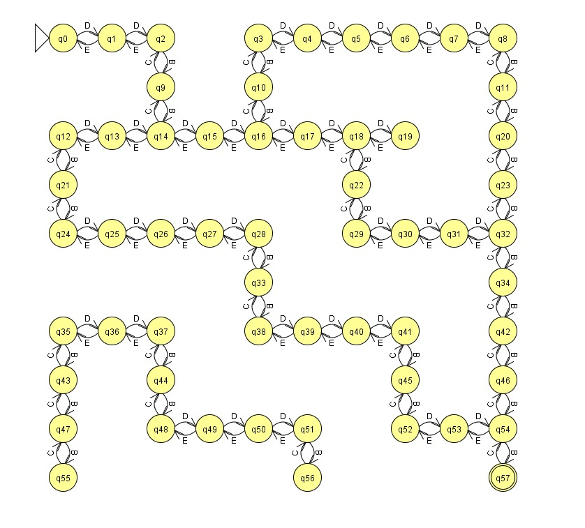

# 🧭 Jogo do Labirinto em Python

Um projeto para a materia Linguagens Formais e Autômatos  que simula a travessia de um labirinto com duas abordagens:
- ✅ **Modo Terminal** com movimentação por texto.
- ✅ **Modo Gráfico (GUI)** com botões interativos via Tkinter.

---

## 🧩 Sobre o Projeto

Este jogo foi desenvolvido com o objetivo de demonstrar como um automato finito não deterministico passaria por um labirinto. 

O jogador deve encontrar o caminho do ponto de início (🔵) até a saída (🔴), desviando de paredes (⬛).

---

## 📜 Regras do Jogo do Labirinto

### 🎯 Objetivo
O jogador deve conduzir o personagem do ponto de **início (🔵 / `S`)** até o **ponto de saída (🔴 / `E`)**, evitando as **paredes (⬛ / `#`)** e utilizando apenas caminhos válidos (⬜ / `.`).

---

### 🔄 Como Jogar

#### 🖥️ Modo Terminal (`labirinto_terminal.py`)
- Os labirintos são **gerados automaticamente**, sempre com um caminho garantido até a saída.
- A movimentação é feita por **comandos textuais**: `"cima"`, `"baixo"`, `"esquerda"`, `"direita"`.
- O labirinto e a **posição atual (`P` / verde)** são atualizados a cada jogada no terminal.

#### 🖼️ Modo Gráfico (`labirinto_interface_padronizado.py`)
- O labirinto é **fixo** e exibido em uma interface intuitiva com botões direcionais.
- A movimentação ocorre ao clicar nos botões (↑, ↓, ←, →).
- Ao chegar à saída, uma mensagem de **"🎉 Venceu!"** é exibida.

---

### 🧠 Regras de Funcionamento do Jogo (com base no Autômato Finito)

1. **Estado Atual (`self.estado_atual`)**  
   - Representa a célula onde o jogador está atualmente.

2. **Transições (`mover(direção)`)**  
   - A cada comando, o autômato tenta mudar de estado (célula).
   - Se a célula de destino for válida (livre e dentro dos limites), a transição acontece.

3. **Transições Inválidas**
   - Se o movimento for para uma parede ou fora do labirinto, o comando é ignorado.

4. **Estado Final (`self.estado_final()`)**
   - Se o jogador alcança a célula da saída, o jogo termina com sucesso.

---

### 📐 Legenda dos Símbolos

| Símbolo | Significado              | Representação   |
|---------|--------------------------|-----------------|
| `#`     | Parede                   | ⬛ Preto        |
| `.`     | Caminho livre            | ⬜ Branco       |
| `S`     | Início                   | 🔵 Azul         |
| `E`     | Saída                    | 🔴 Vermelho     |
| `P`     | Posição atual do jogador | 🟢 Verde        |

---

### 🖥️ Terminal (`labirinto_terminal.py`)

- Geração automática de labirintos com caminho garantido.
- Movimentação por comandos textuais (`cima`, `baixo`, `esquerda`, `direita`).
- Exibição em tempo real da posição do jogador no labirinto.

### 🖼️ Interface Gráfica (`labirinto_interface_padronizado.py`)

- Labirinto pré-definido e fixo.
- Interface intuitiva com botões direcionais.
- Feedback visual da movimentação do jogador.

---

## ⚙️ Como Executar

### 1. Pré-requisitos

- Python 3.x instalado  
- `Tkinter` (já vem com o Python)

### 2. Rodar Modo Terminal

Dentro do terminal, executar:

`python labirinto_terminal.py`

## 🧠 Como o Autômato está atuando no código?

✅ 1. Estado Atual (`self.estado_atual`)

- Representa a posição atual do jogador no labirinto.

- É atualizado a cada movimento válido.

🔁 2. Transições (`mover(direcao)`)

- Quando o jogador fornece um comando (input), o autômato processa essa entrada e tenta realizar uma transição de estado.

- Se o próximo estado for válido (não é parede, nem fora dos limites), a transição é realizada.

- Isso simula o funcionamento exato de um AFD, onde para cada estado e entrada, há uma transição definida (ou não, se inválida).

❌ 3. Transições Inválidas

- Se a transição leva a uma parede ou fora do labirinto, ela é rejeitada, e o estado atual permanece o mesmo.

- Isso reforça o conceito de um autômato que não muda de estado se não há uma transição válida para a entrada fornecida.

🏁 4. Estado Final (`self.estado_final()`)

- Quando o jogador atinge o estado final (a célula da saída), o autômato reconhece que atingiu o estado de aceitação.

- O jogo termina com uma mensagem de sucesso, assim como um AFD que reconhece uma cadeia ao chegar a um estado final.

## 🧾 Resumo da Lógica do Autômato no Código

| Elemento do AFD	    | Implementação no Código                       |
| ------------------- | --------------------------------------------- |
| Estados             |   Células do labirinto (x, y)                 |
| Estado Inicial	    |   self.inicio                                 |
| Estado Atual	       |   self.estado_atual                           |
| Estado Final	       |   self.fim                                    |
| Alfabeto (Entradas) |	  ["cima", "baixo", "esquerda", "direita"]    |
| Transições	       |   Método mover(direcao)                       |
| Regras de Transição |   Método estado_valido(estado)                |
| Aceitação da Cadeia |   Quando estado_atual == fim                  |

### 🧠 Representação Formal da Transição:

Seja A( Q, Σ, δ, q0, F ):

* Q: conjunto de estados (todas as células (x, y) do labirinto)

* Σ: alfabeto = {cima, baixo, esquerda, direita}

* δ: função de transição δ(q, σ) = q'

* q0 : estado inicial

* F : conjunto de estados de aceitação

Então:

* δ((x, y), 'cima')    = (x-1, y) se célula livre

* δ((x, y), 'baixo')   = (x+1, y) se célula livre

* δ((x, y), 'esquerda')= (x, y-1) se célula livre

* δ((x, y), 'direita') = (x, y+1) se célula livre

### Diagrama da função de transição

| Estado Atual | Entrada 'C' | Entrada 'B' | Entrada 'D' | Entrada 'E' |
|--------------|-------------|-------------|-------------|-------------|
| q0           | -           | -           | q1          | -           |
| q1           | -           | -           | q2          | -           |
| q2           | -           | q9          | -           | q1          |
| q3           | -           | q10         | q4          | -           |
| q4           | -           | -           | q5          | q3          |
| q5           | -           | -           | q6          | q4          |
| q6           | -           | -           | q7          | q5          |
| q7           | -           | -           | q8          | q6          |
| q8           | -           | q11         | -           | q7          |
| q9           | q2          | q14         | -           | -           |
| q10          | q3          | q15         | -           | -           |
| q11          | q8          | q20         | -           | -           |
| q12          | -           | q21         | q14         | -           |
| q13          | -           | -           | q14         | q12         |
| q14          | -           | -           | q15         | q13         |
| q15          | -           | -           | q16         | q14         |
| q16          | -           | -           | q17         | q15         |
| q17          | -           | -           | q18         | q16         |
| q18          | -           | -           | q19         | q17         |
| q19          | -           | -           | -           | q18         |
| q20          | q11         | q23         | -           | -           |
| q21          | q12         | q24         | -           | -           |
| q22          | q18         | q29         | -           | -           |
| q23          | q20         | q32         | -           | -           |
| q24          | q21         | -           | q25         | -           |
| q25          | -           | -           | q26         | q24         |
| q26          | -           | -           | q27         | q25         |
| q27          | -           | -           | q28         | q26         |
| q28          | -           | q33         | -           | q27         |
| q29          | q22         | -           | q30         | -           |
| q30          | -           | -           | q31         | q29         |
| q31          | -           | -           | q32         | q30         |
| q32          | q23         | q34         | -           | -           |
| q33          | q28         | q38         | -           | -           |
| q34          | q32         | q42         | -           | -           |
| q35          | -           | q43         | q36         | -           |
| q36          | -           | -           | q37         | q35         |
| q37          | -           | q44         | -           | q36         |
| q38          | q33         | -           | q39         | -           |
| q39          | -           | -           | q40         | q38         |
| q40          | -           | -           | q41         | q39         |
| q41          | -           | q45         | -           | q40         |
| q42          | q34         | q46         | -           | -           |
| q43          | q35         | q47         | -           | -           |
| q44          | q37         | q48         | -           | -           |
| q45          | q41         | q52         | -           | -           |
| q46          | q42         | q54         | -           | -           |
| q47          | q43         | q55         | q55         | -           |
| q48          | q44         | -           | q49         | -           |
| q49          | -           | -           | q50         | q48         |
| q50          | -           | -           | q51         | q49         |
| q51          | -           | q56         | -           | q50         |
| q52          | q45         | -           | q53         | -           |
| q53          | -           | -           | q54         | q52         |
| q54          | q46         | q57         | -           | q53         |
| q55          | q47         | -           | -           | -           |
| q56          | q51         | -           | -           | -           |
| q57          | q54         | -           | -           | -           |

* Representação do autômato no JFLAP

## 📄 Código

### 🔧 class AutomatoLabirinto

* Classe que simula um autômato finito para navegação em um labirinto.

`__init__(labirinto, inicio, fim)` :

* Inicializa o autômato com o labirinto, o ponto inicial e o ponto final.

labirinto: matriz 2D com paredes (#) e caminhos (.) :

* inicio: tupla (linha, coluna) do ponto inicial

* fim: tupla (linha, coluna) da saída

`mover(direcao)` :
* Move o jogador em uma das 4 direções, se possível.

* Parâmetro: 'cima', 'baixo', 'esquerda' ou 'direita'

* Retorna: True se o movimento foi válido, False caso contrário.

`estado_valido(estado)` :

* Verifica se uma posição é válida (não é parede e está dentro dos limites).

* Parâmetro: estado (tupla com coordenadas).

* Retorna: True ou False.

`estado_final()` :
* Verifica se o jogador chegou ao estado final.

* Retorna: True se chegou na saída (fim), False caso contrário.

`exibir_labirinto()` :

* Exibe o labirinto no terminal.

### 🔁 def gerar_labirinto_aleatorio(tamanho)

* Gera uma matriz tamanho x tamanho com caminhos aleatórios usando busca em profundidade (DFS).

* Início fixo em (0, 0)

* Fim fixo em (tamanho - 1, tamanho - 1)

* Retorna: labirinto, inicio, fim

### ▶️ def main()

* Função principal:

  - Gera o labirinto

  - Inicializa o autômato

* Lê comandos do jogador até que ele chegue à saída

## 🖼️ Interface Gráfica 

### 🔧 Classe JogoLabirinto

* `__init__( )` : Inicializa a janela, o canvas, os botões e o labirinto.

* Define o ponto inicial, o final e a posição atual do jogador.

### 📦 Métodos principais

* `criar_botoes()`

  - Cria os botões de movimento (↑, ↓, ←, →) no layout.

* `mover(direcao)` :

  - Move o jogador na direção especificada, se o caminho for válido. Se o jogador chegar ao fim, exibe a mensagem "🎉 Venceu!".

* `estado_valido(estado)` :

  - Verifica se a célula é acessível (não é parede nem fora da matriz).

* `desenhar_labirinto()` : 

  - Desenha o labirinto no canvas.

* `definir_labirinto_fixo()` :

  - Retorna uma matriz 10x10 com o layout do labirinto, o ponto de início e o de saída.

